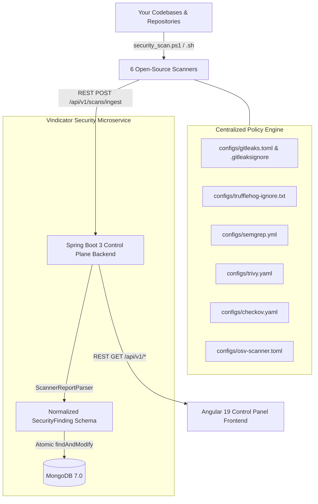

# 🛡️ Vindicator Security Control Plane

[](https://opensource.org/licenses/Apache-2.0)
[](https://spring.io/projects/spring-boot)
[](https://angular.io)
[](https://www.oracle.com/java/)
[](https://www.mongodb.com)
[](https://docs.docker.com/compose/)

> **A centralized, open-source security orchestration and intelligence control plane for modern software engineering teams.**

The **Vindicator Security Control Plane** replaces cluttered, heavyweight vulnerability managers (such as DefectDojo) with a fast, self-hosted, configuration-driven platform. It aggregates raw reports from industry-standard OSS scanners, normalizes them into a canonical schema, eliminates false positives via mounted configuration policies, and orchestrates **deterministic automated remediation** using **Renovate Bot**, **OpenRewrite**, and **AI Remediation Agents**.

---

## ✨ Features & Why Vindicator

- **🚫 Zero Proprietary Lock-In**: Delegates actual scanning to 6 best-in-class open-source tools (**Trivy**, **Semgrep**, **Gitleaks**, **Checkov**, **OSV-Scanner**, and **TruffleHog**).
- **⚡ 60-Second Deployment**: Runs anywhere via a single `docker compose up -d` command with MongoDB 7.0, Spring Boot 3, and Angular 19.
- **🛡️ Built-in False-Positive Prevention**: Pre-configured exclusion policies under `configs/` automatically filter out local `.venv/` virtual environments, test mock fixtures, and demo API keys.
- **🤖 Three-Pillar Automated Remediation**:
  1. **Renovate Bot (`RENOVATE_AUTO`)**: Automated dependency version-bump Pull Requests.
  2. **OpenRewrite (`OPENREWRITE_AUTO`)**: Deterministic Maven AST recipes (`mvn rewrite:run`) to refactor OWASP Top 10 Java & Spring Boot security anti-patterns automatically.
  3. **AI Remediation Agents (`AI_ASSISTED`)**: Live prompt generation and context blocks for LLMs / agentic coding assistants to fix complex secret rotations or IaC misconfigurations.
- **🎨 Premium Dark-Mode UI**: Built with Angular 19 using an HSL-tailored Glassmorphism design system, instant filtering, and severity distribution meters.

---

## 🏛️ System Architecture



---

## 🔍 Supported Scanners & Exclusions

| Scanner | Target Area | Default Mounted Policy |
| :--- | :--- | :--- |
| **Gitleaks** | Repository Secret & API Key Leak Prevention | `configs/gitleaks.toml` & `.gitleaksignore` |
| **TruffleHog** | Verified High-Entropy Credentials | `configs/trufflehog-ignore.txt` |
| **Semgrep** | Static Analysis (SAST) & OWASP Top 10 | `configs/semgrep.yml` |
| **Trivy** | Container Image & Dependency CVEs | `configs/trivy.yaml` |
| **Checkov** | Infrastructure-as-Code (Dockerfile / K8s / TF) | `configs/checkov.yaml` |
| **OSV-Scanner**| Direct & Transitive Open Source Vulnerabilities | `configs/osv-scanner.toml` |

---

## 🚀 Quickstart (60 Seconds)

### 1. Launch the Control Plane
Make sure you have **Docker** and **Docker Compose** installed:

```bash
git clone https://github.com/vindicator-oss/security-scanner.git
cd security-scanner

docker compose up --build -d
```

- **Executive Control Panel (UI)**: [http://localhost:3000](http://localhost:3000)
- **REST API Endpoint**: [http://localhost:8080/api/v1/dashboard/summary](http://localhost:8080/api/v1/dashboard/summary)

---

### 2. Run a Security Scan Pipeline
Scan any repository on your machine using our cross-platform runner scripts. The script executes the containers, applies exclusions from `configs/`, and ingests results into your dashboard automatically.

#### PowerShell (Windows)
```powershell
.\security_scan.ps1 -TargetDir "C:\projects\my-app" -Asset "my-app" -IngestUrl "http://localhost:8080/api/v1/scans/ingest"
```

#### Bash (Linux / macOS)
```bash
chmod +x security_scan.sh
./security_scan.sh "/path/to/my-app" "ALL" "true"
```

---

## ⚡ Automated Remediation Workflows

When viewing the **Automated Remediation & AI Agent Hub** in the UI, every finding is categorized into an actionable remediation stream:

1. **Renovate Auto-PR**: Copy the pre-generated dependency upgrade configuration directly into your `renovate.json`.
2. **OpenRewrite Maven Cmd**: Copy and run deterministic refactor commands in your terminal:
   ```bash
   mvn org.openrewrite.maven:rewrite-maven-plugin:run -Drewrite.activeRecipes=org.openrewrite.java.spring.security6.UpgradeSpringSecurity_6_0
   ```
3. **AI Prompt Context**: Copy the structured Markdown context prompt directly into **Google Antigravity**, **Gemini**, or **Cursor** to let an autonomous AI agent resolve architectural misconfigurations.

---

## 🤝 Contributing

We welcome contributions from the open-source community! Whether you want to add a new `ScannerReportParser` adapter (such as **Snyk**, **Grype**, or **SonarQube**) or improve UI themes, please read our [Contributing Guide](CONTRIBUTING.md) and [Security Policy](SECURITY.md).

---

## 📜 License

Licensed under the [Apache License, Version 2.0](LICENSE).  
Copyright © 2026 **Vindicator** & **Archit Singh**.
